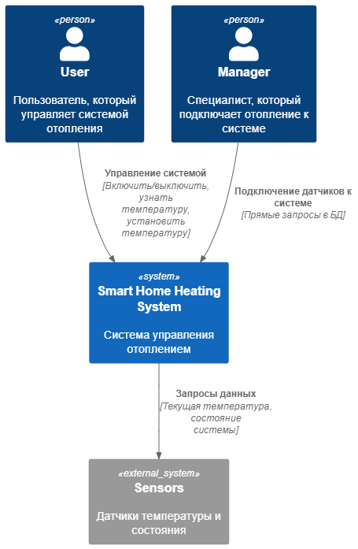
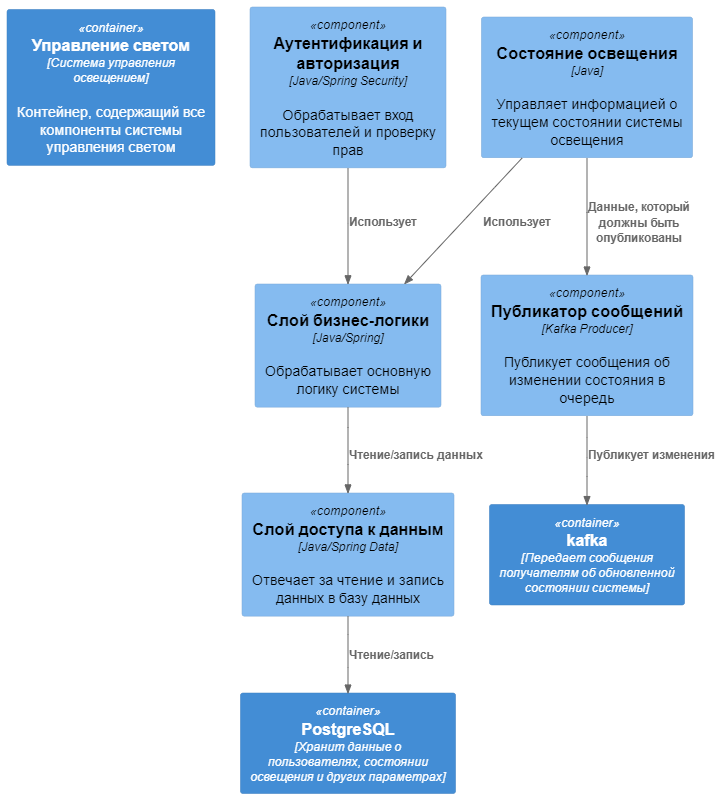
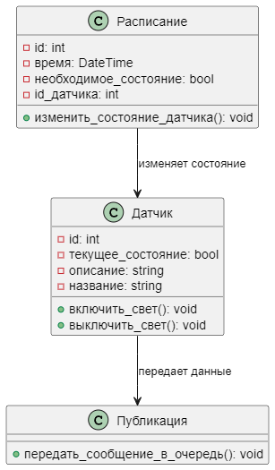
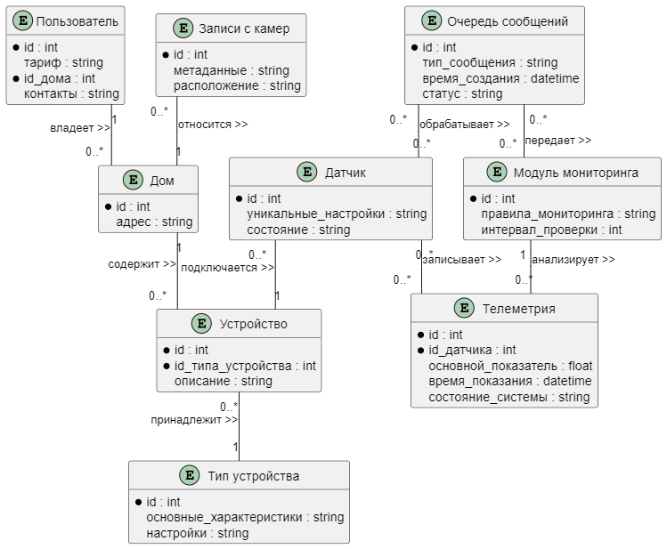

# Project_template

Тип: Материал
Родитель: Описание проекта для 11 когорты (https://www.notion.so/11-03abbbbc8bcb49ed9b85c9b6d1174056?pvs=21)

Это шаблон для решения проектной работы. Структура этого файла повторяет структуру заданий. Заполняйте его по мере работы над решением.

# Задание 1. Анализ и планирование

<aside>
💡

Чтобы составить документ с описанием текущей архитектуры приложения, можно часть информации взять из описания компани и условия задания. Это нормально.

</aside>

### 1. Описание функциональности монолитного приложения

**Управление отоплением:**

- Пользователи могут: устанавливать необходимую температуру, влючать и выключать систему отопления
- Система поддерживает: передачу запросов по HTTP, хранение данных о системе (текущем состоянии, температуре), запрос данных с датчиков

**Мониторинг температуры:**

- Пользователи могут: просматривать текущую температуру и состояние системы (включена или выключена)
- Система поддерживает: хранение температуры с датчиков и формирование общего состояния системы, для передачи пользователю

### 2. Анализ архитектуры монолитного приложения

Перечислите здесь основные особенности текущего приложения: какой язык программирования используется, какая база данных, как организовано взаимодействие между компонентами и так далее.

- Язык программирования: Java
- База данных: PostgreSQL
- Архитектура: Монолитная, все компоненты системы (обработка запросов, бизнес-логика, работа с данными) находятся в рамках одного приложения.
- Взаимодействие: Синхронное (HTTP), запросы обрабатываются последовательно.
- Масштабируемость: Ограничена, так как монолит сложно масштабировать по частям.
- Развёртывание: Требует остановки всего приложения.

### 3. Определение доменов и границы контекстов

Домены

- Управление системой отопления. Домен, который включает все операции по управлению системой (так как в текущем варианте есть ТОЛЬКО система отопления, то и домен соответствующий), включает в себя: управление состоянием системы, установку температуры, взаимодействие с датчиками (получение температуры и состояния). В домен можно включить подключение датчиков, так как это тоже управление системой
- мониторинг системы отопления. Домен, который включает в себя все операции по хранению и обработке данных (передача пользователю) о состоянии системы

Контексты
- Управления системой отопления имеет следующую границу: не занимается мониторингом
- Мониторинг системы использует данные из других контекстов, но не управляет состоянием системы напрямую

### **4. Проблемы монолитного решения**

- Сложность масштабирования бизнес-процессов: монолит включает в себя всё решение. Добавление новых устройств, особенности работы с текущими устройствами или добавление возможности подключаться клиентам самим потребует реализации нового функционала, который отличается от текущего, что в рамках монолитного приложения может быть сложным: тестирование, поддержание, изменение нового функционала, создание индивидуальной гибкости
- Сложность разработки - из первого вытекает увеличение времени разработки, повышение риска ошибок, сложность погружение новых разработчиков в процесс
- Сложности масштабирования - с ростом количества клиентов и использования разных частей системы, может появиться необходимость в увеличении ресурсов конкретной части приложения, допустим мониторинга системы, но в текущей реализации сделать этого не получится, придется поднимать мощности для всего приложения, что со временем станет очень дорогим решением
- Ограничение гибкости - в монолите необходимо использовать одни инструменты для каждого модуля, что ограничивает введение современных инструментов без переписывания всего кода приложения, а это создает риск отставания от конкурентов, лишает возможности в экспериментах
- Проблемы с развертыванием - приложение необходимо пересобирать всем монолитом, что создает увеличение времени простоя, риск для системы в повышенных ошибках, создание негативного отклика от клиентов
- Единая точка отказа - все приложение является большой точкой отказа и ошибки в одной из его частей, будут влиять на все процессы,создавая недоступность системы, сложности восстановления и потери данных

### 5. Визуализация контекста системы — диаграмма С4

# Задание 2. Проектирование микросервисной архитектуры

В этом задании вам нужно предоставить только диаграммы в модели C4. Мы не просим вас отдельно описывать получившиеся микросервисы и то, как вы определили взаимодействия между компонентами To-Be системы. Если вы правильно подготовите диаграммы C4, они и так это покажут.

**Диаграмма контейнеров (Containers)**

**Диаграмма компонентов (Components)**

**Диаграмма кода (Code)**

# Задание 3. Разработка ER-диаграммы

Четвёртое задание — дополнительное. Его можно сделать по желанию. Чтобы ревьюер быстрее проверил ваше решение, укажите, сделали вы это задание или нет. Для этого оставьте нужный эмодзи около заголовка задания:

✅ — вы выполнили задание.

❌ — вы пропустили задание.

# ✅ ❌ Задание 4. Создание и документирование API

### 1. Тип API

Для взаимодействия с сервисом отопленяи будут использовать два вида интеграций:
- синхронный набор взаимодействий (REST), для взаимодействия клиентского приложения с сервисом, для изменения состояния системы
- асинхронный набор взаимодействий (kafka), для публикаций изменений системы в очередь, чтобы все подписчики (системы мониторинга и управления датчиками) могли получать команды и изменения

### 2. Документация API

[asyncapi](AsyncAPI.YAML)
[swagger](swagget.yaml)
